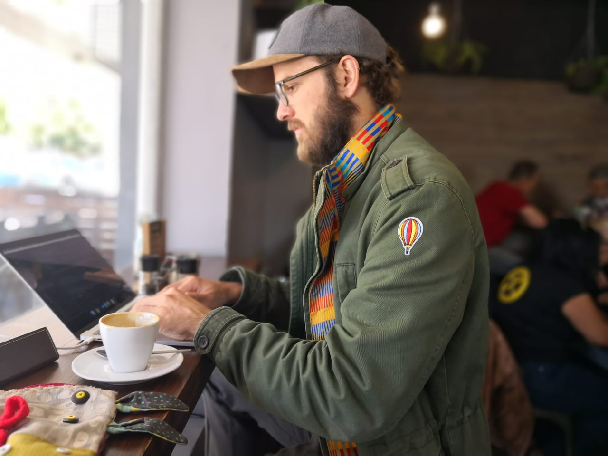

# Herman Martinus
## *Tech professional | Humanist | Rock-climber*

## Education
BIS in Computer Science & Multimedia - University of Pretoria

## Experience

## Developer Coach at MAKE
>[make.offerzen.com](https://make.offerzen.com/)
>
>**Part time**
>
>**Role:** Coaching Make Day groups of ~20 people multiple times per week in a variety of technologies.

### Front-end engineer at GetMyBoat
>[getmyboat.com](https://getmyboat.com)
>
>**Duration:** 2 years
>
>**Role:** Building and scaling the GetMyBoat platform to more than 1 million users, with focus on (but not limited to) the web front-end.
>
>**Technologies:**
* React/Redux - JS
* Webpack
* Babel
* SCSS
* Django - Python
* CodeIgniter - PHP (legacy)

### Video game designer/developer at Sea Monster
>[seamonster.co.za](http://seamonster.co.za)
>
>**Duration:** 3 years
>
>**Role:** Designing and building a wide range of video games from small mobile AR applications through to fully fledged VR simulations.  
>
>**Technologies:**
* Unity3D
* Vuforia
* Oculus

### E-commerce systems developer at Vaimo
>[vaimo.com](http://vaimo.com)
>
>**Duration:** 1 year
>
>**Role:** Developing and maintaining high traffic e-commerce systems for a variety of clients.
>
>**Technologies:**
* Magento - PHP
* jQuery - JS
* HTML/CSS

### Heroic Designs
>[heroicdesigns.co.za](http://heroicdesigns.co.za)
>
>**Duration:** 2 year
>
>**Role:** Developing and maintaining small business/personal websites for a variety of clients.
>
>**Technologies:**
* PHP
* jQuery - JS
* HTML/CSS

## Other interesting things

### JustSketch.Me
>[justsketch.me](http://justsketch.me)
>
>**Interactive 3D models for figure drawing**
>
>* Used by thousands of artists, illustrators and graphic designers every day
>* Built in WebGL, HTML and JS
>* Donation based

### Horus
>[github.com/HermanMartinus/Horus](https://github.com/HermanMartinus/Horus)
>
>**A simple, terminal-based password manager and 2FA generator.**
>* Instead of saving passwords, Horus generates passwords using MD5 hashing of the account name and secret seed phrase and copies it directly to the clipboard.

### Global Game Jam
>[globalgamejam.org/](https://globalgamejam.org/)
>
>**An annual distributed game jam (a game jam is a hackathon for video games. It is a gathering of people for the purpose of planning, designing, and creating one or more games within a short period of time).**
>* 2016 winner of Award for Technical Excellence
>* 2017 winner of Award for Most Fun Game

### Why Pictures
>[whypictures.com](http://whypictures.com)
>
>**My personal webcomic.**
>* A simple webcomic for a complex world

## Technical Skills
* Agile methodology
* Source Control (Git, Mercurial)
* Docker
* HTML 5/CSS 3
* Python (Django, Flask)
* Javascript (React, Redux, ES6)
* Webpack
* Babel
* SCSS
* Automated testing
* Human-computer interaction
* Visual design
* Adobe Suite
* Unity 3D (C#)

## Hobbies and interestes

* Environmental and social causes:
 * Have done work in accessibility to education (Zuri's lab)
 * Ran a hackathon with Merck and MEST for accessibility to healthcare in impoverished communities
 * Gave a talk at SoapBox on how to build ethical startups
* Rock climbing
* Salsa
* Surfing
* Extensive travel through Africa and the EU
* Game development
* I wear toe socks (generally bright coloured ones)
